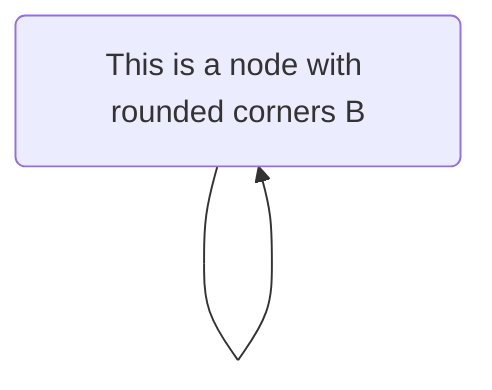

# mcp-sports-nlp

This is a learning repository about the Model Context Protocol (MCP) and its application for accessing Sports Datasets.



## What is Model Context Protocol (MCP)?

"MCP is an open protocol that standardizes how applications provide context to LLMs. Think of MCP like a USB-C port for AI applications. Just as USB-C provides a standardized way to connect your devices to various peripherals and accessories, MCP provides a standardized way to connect AI models to different data sources and tools." ([modelcontextprotocol](https://modelcontextprotocol.io/introduction)) Its structure is composed by:
- MCP Hosts: Programs like Claude Desktop, IDEs, or AI tools that access data through MCP.
- MCP Servers: Lightweight programs that expose specific capabilities through the standardized Model Context Protocol.
- Data Sources: Your computer’s files, databases, or external systems available over the internet (e.g., through APIs).

## Project Structure

This repository is structured as follows:

- `weather/`: Contains code related to accessing and processing weather data, based on [quickstarter server](https://modelcontextprotocol.io/quickstart/server).
- `qasports/`: Contains code related to accessing and processing sports data, based on [qasports](https://huggingface.co/datasets/leomaurodesenv/QASports2).

## Adding the Server to Claude AI (or other MCP Hosts)

You can add your MCP server to Claude AI or any other MCP Clients that support the protocol.

### Adding the Command Line Interface to Claude AI

Using Claude AI, you can inform how to access this MCP server via command line interface. You can read more [in quickstarter](https://modelcontextprotocol.io/quickstart/server).

### For MacOS/Linux

```sh
code ~/Library/Application\ Support/Claude/claude_desktop_config.json`
```

### Windows

```sh
code $env:AppData\Claude\claude_desktop_config.json
```

Then, you need to fill the JSON file with the MCP server information.

```json
{
  "mcpServers": {
    "weather": {
      "command": "uv",
      "args": [
        "--directory",
        "/ABSOLUTE/PATH/TO/PARENT/FOLDER/weather",
        "run",
        "main.py"
      ]
    }
  }
}
```

### Adding the Server to MCP Host

To use the MCP server with an MCP Host like Claude AI, follow these general steps:

1.  **Start the MCP Server:**
    *   Navigate to the server's directory (e.g., `cd weather/`).
    *   Run the server according to its instructions. For example, `uv run main.py`.
    *   By default, the quickstart server from the MCP documentation runs on `http://localhost:3000`. Note the host and port your server is running on.

2.  **Configure the MCP Host (Claude AI):**
    *   Open your MCP Host application (e.g., Claude Desktop).
    *   Look for an option to add or manage MCP Servers. This might be in settings, preferences, or a dedicated "Context Sources" or "MCP Servers" section.
    *   Add a new server and provide the address where your MCP server is running (e.g., `http://localhost:3000`).
    *   Once added and enabled, the MCP Host should be able to query your server for context.

Please refer to the specific documentation of your MCP Host for the exact steps to add a new MCP server, as the UI and terminology might vary.
